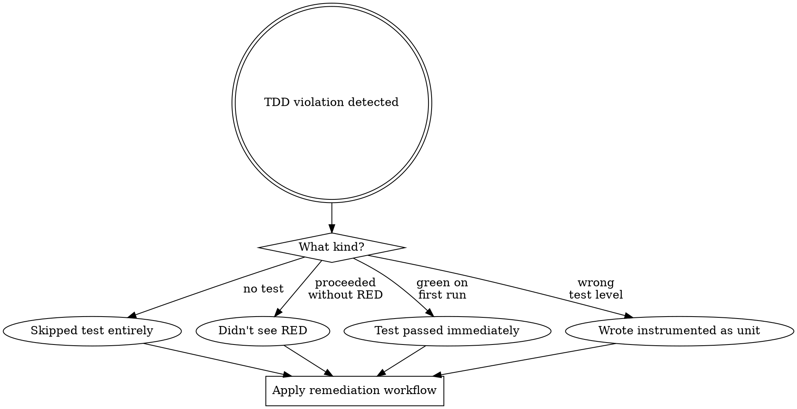
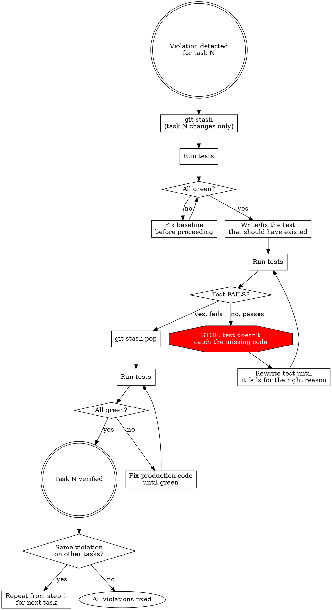

# TDD Verify — Retroactive RED Proof via Git Stash

## Overview

You violated TDD. Maybe you skipped a test, maybe you didn't see RED, maybe you wrote a test that passed immediately. This skill fixes it retroactively using git stash to prove the test is valid.

**Core principle:** A test you never saw fail proves nothing. If you skipped RED, you must prove RED now.

## When to Use



Trigger conditions:

- You wrote production code for a task but there's no test for it
- You wrote a test but never ran it or never saw RED output
- You ran the test and it passed on the first try (test-after smell)
- You skipped an instrumented test because "it's hard" and wrote a unit test that doesn't actually exercise the behavior
- You told yourself "this doesn't need a test" (it does)

## Self-Diagnosis: Which Violation?

Before applying the workflow, answer honestly:

| Question | If YES |
|----------|--------|
| Did I skip a test because I thought it HAD to be instrumented and I didn't want to deal with the emulator? | **Nobody forbade you from writing instrumented tests.** Write one now. |
| Did I skip a test because I forgot or thought it wasn't needed? | **Every task gets a test. You forgot the discipline.** Write one now. |
| Did I write a test but never saw it fail? | **A test you never saw fail proves nothing.** Prove RED now. |
| Did the test pass immediately on first run? | **You wrote a test-after, not test-first.** The test may be testing the wrong thing. Fix it. |

## The Remediation Workflow

For EACH task where you violated TDD:



### Step-by-step

**1. Stash production changes for the violated task**

```bash
git stash push -m "tdd-verify: task N changes" -- <files changed by task N>
```

If multiple tasks share files, stash ALL changes since the last clean commit and address tasks in order.

**2. Verify GREEN baseline**

```bash
cd android && ./gradlew testDebugUnitTest
# AND if instrumented tests exist:
cd android && ./gradlew connectedStagingAndroidTest
```

All tests must pass. If they don't, fix the baseline first — you can't prove RED against a broken baseline.

**3. Write or fix the test**

- If you skipped the test entirely: write it now. Remember: if it needs to be instrumented (navigation, Hilt wiring, Compose UI, DB queries), write an instrumented test. Nobody forbids it.
- If your test passed immediately: the test is wrong. It doesn't actually test the behavior your code adds. Rewrite the assertion or the setup so it fails without the production code.
- If you didn't see RED: the test may or may not be valid. Run it now to find out.

**Critical:** A test written at this point that PASSES is worthless. It proves nothing about whether your production code is needed. If it passes, rewrite it until it fails.

**4. Verify RED**

```bash
cd android && ./gradlew testDebugUnitTest
# OR for instrumented:
cd android && ./gradlew connectedStagingAndroidTest
```

You MUST see the test fail. The failure must be because the production code is missing (not a typo, not a setup error). Read the failure message and confirm it's the RIGHT failure.

**5. Re-apply stashed changes**

```bash
git stash pop
```

**6. Verify GREEN**

```bash
cd android && ./gradlew testDebugUnitTest
# AND if instrumented:
cd android && ./gradlew connectedStagingAndroidTest
```

All tests must pass. If they don't, fix until green.

**7. Repeat for other violated tasks**

If you committed the same violation on multiple tasks, go back to step 1 for each.

## Red Flags — You Need This Skill NOW

- You just said "this test needs the emulator, I'll skip it" — NO. Write an instrumented test.
- You just said "this is hard to test" — NO. It requires more setup. Do the setup.
- You ran a test and it passed on the first try — STOP. That's test-after.
- You wrote production code "just to check" and then wrote the test — STOP. You violated TDD.
- You're about to move to the next task and you have untested production code — STOP.

## Common Rationalizations

| Excuse | Reality |
|--------|---------|
| "The test needs an emulator, that's too slow" | Instrumented tests exist for a reason. Run them. |
| "I'll write the test later" | You won't. And if you do, it'll be test-after. |
| "The test passed, so it's fine" | Passed immediately = doesn't test your change. Fix it. |
| "I already manually verified it works" | Manual verification is not TDD. Write the test. |
| "I can't stash cleanly, too many changes" | `git stash push -m "msg" -- file1 file2` works per-file. |
| "This is overkill for a small change" | Small changes break things. The stash workflow takes 2 minutes. |

## Integration with Other Skills

This skill is invoked automatically by `/add-feature` and `/fix-bug` when a TDD violation is detected. You don't need to invoke it manually — but if you catch yourself mid-violation, invoke it immediately.

**REQUIRED BACKGROUND:** superpowers:test-driven-development
